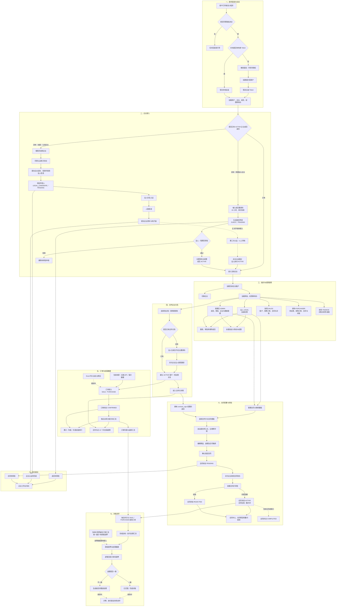

# 财源通（TradePass）整体业务流程

本文档根据当前仓库中的微信小程序页面、后端接口和业务服务整理，描述从用户登录、企业接入到合作关系、订单、合同及对账的端到端业务流程。

图中：

- 实线表示当前已有的主要业务流程。
- 虚线表示依赖第三方服务、人工审核或尚在规划中的能力。
- `ACTIVE`、`PENDING` 等大写内容为当前代码使用的业务状态。

## 整体业务流程图

## 关键业务状态

| 业务对象 | 当前状态流转 |
| --- | --- |
| 企业认证 | `NOT_SUBMITTED` → `PENDING` → `PENDING_REVIEW` → `VERIFIED` |
| 实名认证 | `NOT_STARTED` → `VERIFIED` |
| 人脸认证 | `NOT_STARTED` → `VERIFIED` |
| 电子章 | `NOT_UPLOADED` → `PENDING_REVIEW` → `UPLOADED` |
| 企业成员 | `PENDING` → `ACTIVE`；拒绝时删除申请 |
| 合作关系 | 创建或接受合作邀请后进入 `ACTIVE` |
| 订单 | 创建后进入 `CONFIRMED` |
| 合同 | `PENDING` → `ACTIVE` 或 `REJECTED`；界面预留 `COMPLETED` |

## 角色与主要权限

| 角色 | 主要业务能力 |
| --- | --- |
| 法人 `LEGAL` | 全部权限、企业认证、成员管理、合作企业邀请 |
| 管理员 `ADMIN` | 成员与授权管理、企业管理、电子章和合同模板管理 |
| 销售 `SALES` | 供应商视角、客户关系、销售订单、合同签署与对账 |
| 采购 `PURCHASER` | 采购商视角、采购订单、合同签署与对账 |
| 财务 `FINANCE` | 发票查看和对账 |
| 访客 `GUEST` | 无默认业务权限，等待管理员分配角色 |

## 当前实现边界

1. 实名、人脸、电子章和企业审核在生产环境尚未接入正式服务商。
2. 企业创建后，`LEGAL_CANDIDATE/PENDING` 到正式法人 `LEGAL/ACTIVE` 的审核回调尚未形成完整闭环。
3. 订单已有创建、查询、汇总和排行接口，小程序当前主要使用演示数据；Excel 导入和后台修正仍在规划中。
4. 合同目前支持 `PENDING → ACTIVE/REJECTED`，尚无履约完成操作。
5. 对账目前只有订单金额汇总，发票、收付款和差异处理尚未接入。
6. 合同审批接口当前主要校验合同是否为 `PENDING`，后续还应补充对方企业身份及审批权限校验。

## 主要实现位置

- 登录与会话：`backend/src/main/java/com/tradepass/service/AuthService.java`
- 企业、成员与角色：`backend/src/main/java/com/tradepass/service/CompanyService.java`
- 订单、合作方与合同：`backend/src/main/java/com/tradepass/service/TradeService.java`
- 首页排行：`backend/src/main/java/com/tradepass/service/RankingService.java`
- 小程序页面：`miniprogram/pages/`
