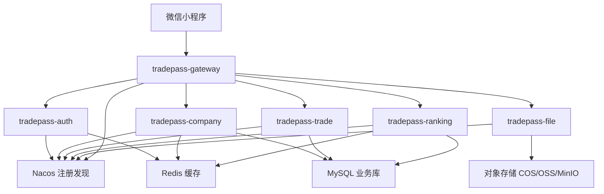
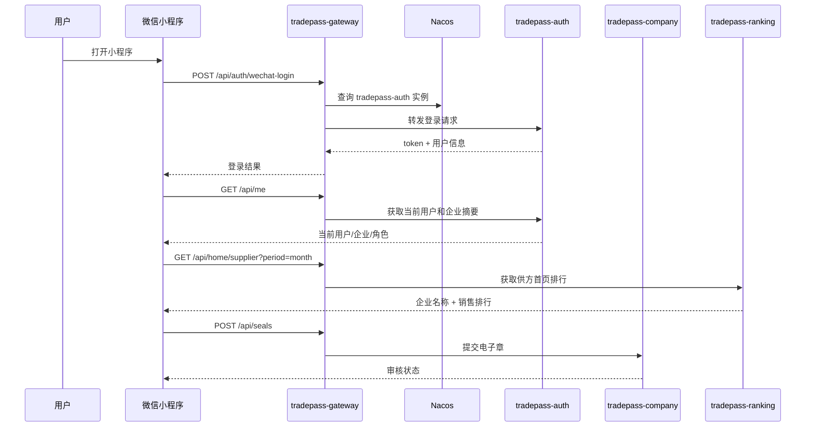
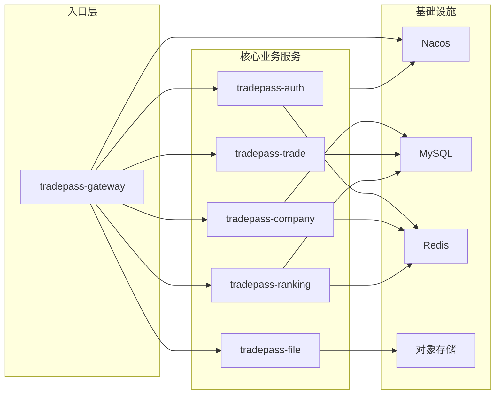
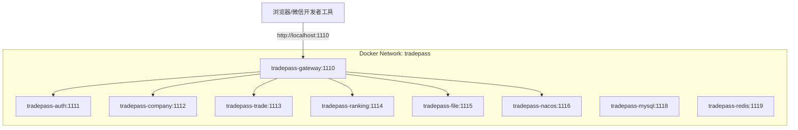
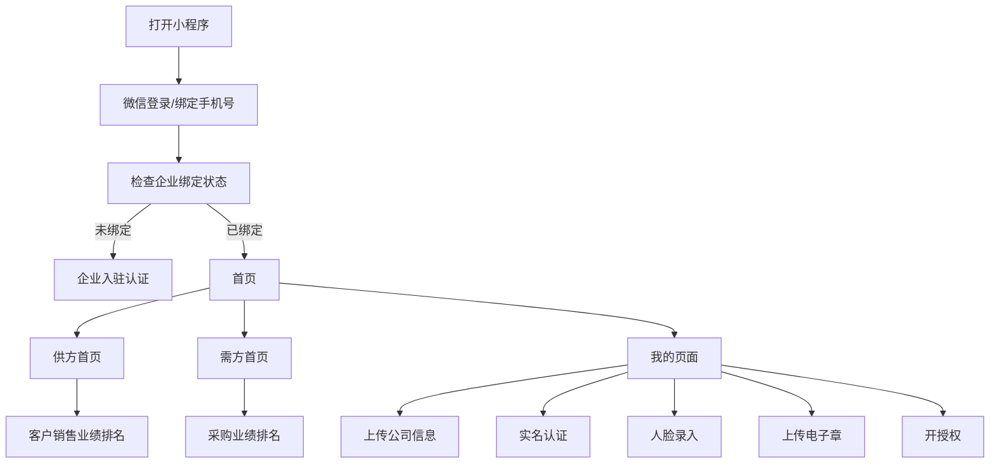
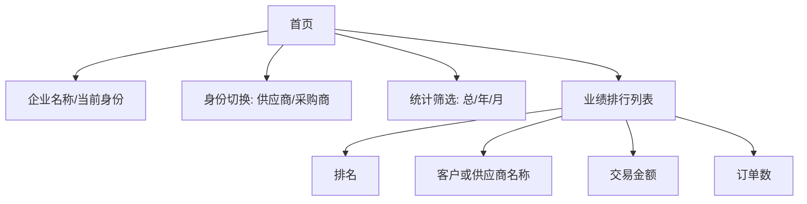
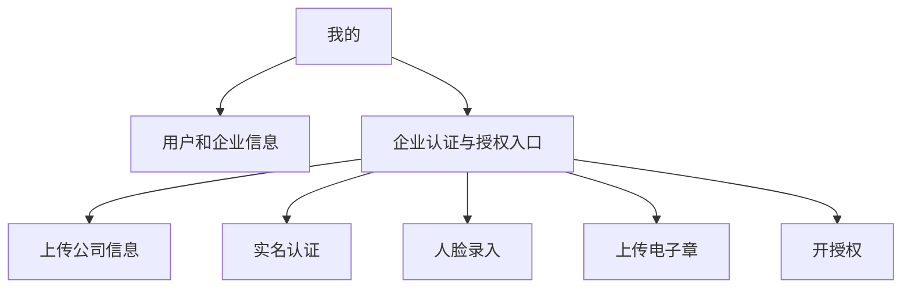

# 贸易通微服务架构设计

## 统一命名

所有后端模块、Maven `artifactId`、Docker 服务名、Nacos 服务名统一使用 `tradepass-*` 前缀。

| 模块 | 职责 | 默认端口 |
| --- | --- | --- |
| `tradepass-common` | 公共响应、异常、DTO | 无 |
| `tradepass-gateway` | API 网关、统一入口、路由转发 | `1110` |
| `tradepass-auth` | 微信登录、手机号绑定、当前用户 | `1111` |
| `tradepass-company` | 企业信息、认证、实名、人脸、电子章、授权 | `1112` |
| `tradepass-trade` | 订单、客户/供应商交易数据 | `1113` |
| `tradepass-ranking` | 供方/需方首页、销售/采购排行 | `1114` |
| `tradepass-file` | 上传凭证、对象存储适配 | `1115` |

## 总体架构图

## 请求调用链

## 服务边界图

## Docker 部署拓扑

## 小程序页面展示图

## 首页展示结构

## 我的页面展示结构

## 后续演进

- 当前阶段使用 Nacos 做服务注册发现，网关统一暴露 `/api/**`。
- 后续可以加入 Sentinel 做限流熔断，RocketMQ 做订单事件和排行异步统计。
- Seata 只建议在确实出现跨服务强一致事务后再引入，避免过早增加复杂度。
- MySQL 表结构已在 `backend/src/main/resources/schema.sql` 中准备，当前代码仍保留内存演示数据，下一步可替换为 MyBatis-Plus 持久化。
